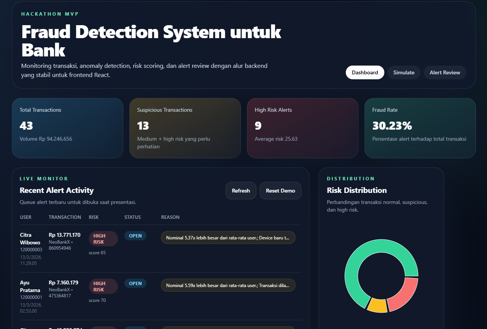
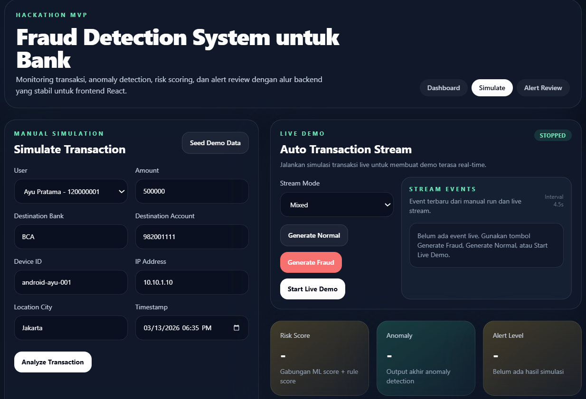
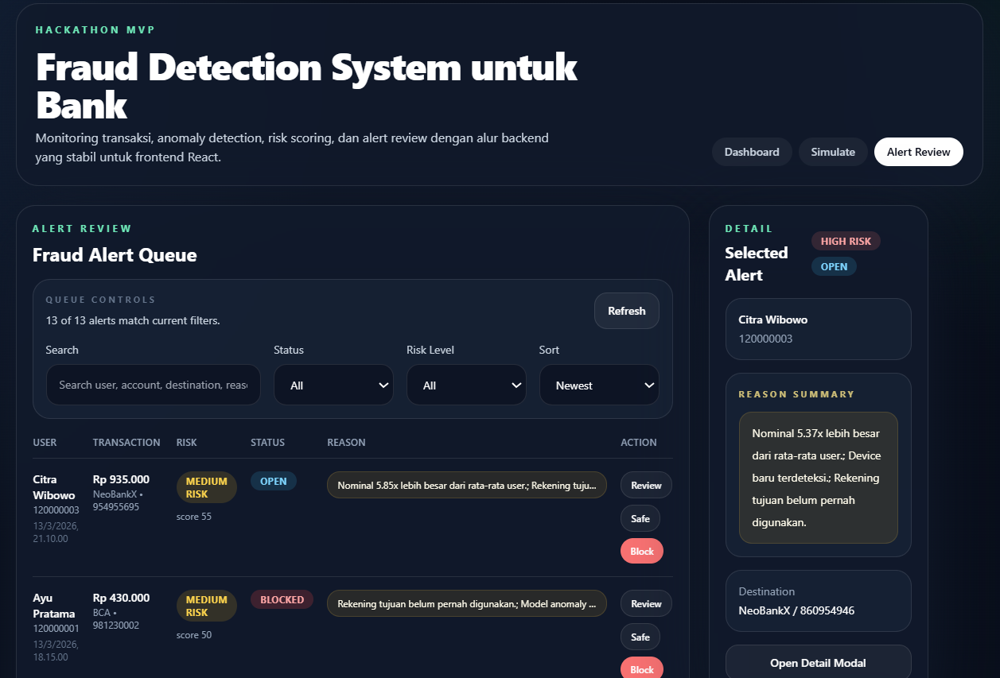

# Fraud Detection System untuk Transaksi Perbankan

Fraud Detection System adalah MVP hackathon untuk mendeteksi transaksi perbankan yang mencurigakan melalui kombinasi rule-based scoring dan machine learning anomaly detection.

Sistem ini membangun baseline perilaku setiap pengguna, mengevaluasi transaksi yang masuk secara cepat, lalu menampilkan skor risiko, alasan deteksi, dan alert investigasi melalui dashboard monitoring.

## Ringkasan

Proyek ini dirancang untuk menunjukkan alur fraud monitoring end-to-end:

- simulasi transaksi normal dan mencurigakan
- analisis pola transaksi per pengguna
- anomaly detection berbasis `IsolationForest`
- perhitungan `risk score` yang dapat dijelaskan
- alert review dengan aksi `open`, `review`, `blocked`, dan `resolved`
- dashboard monitoring untuk kebutuhan demo dan investigasi

## Teknologi

- Backend: FastAPI
- Database: SQLite
- AI/ML: pandas, scikit-learn, numpy
- Frontend utama: React, Tailwind CSS, Recharts
- Frontend cadangan: HTML, CSS, vanilla JavaScript

## Arsitektur Sistem

```text
Dashboard React / Simulator
            |
            v
       FastAPI Backend
            |
            v
   Fraud Detection Engine
            |
            v
       SQLite Database
```

Alur sistem tingkat tinggi:

1. Dashboard atau simulator mengirim transaksi ke backend.
2. FastAPI mengambil histori transaksi pengguna dari SQLite.
3. Fraud engine membangun fitur perilaku dan menghitung sinyal anomali.
4. Backend menggabungkan `ml_score` dan `rule_score` menjadi `risk_score`.
5. Sistem menyimpan transaksi, membuat alert bila perlu, lalu mengirim hasil ke dashboard.

## Alur Sistem Lengkap

Berikut alur lengkap yang terjadi ketika sebuah transaksi masuk ke sistem:

1. Pengguna atau simulator mengirim transaksi melalui form pada dashboard atau halaman simulate.
2. FastAPI menerima request transaksi melalui endpoint `POST /api/transactions/simulate`.
3. Backend menyimpan payload transaksi dan mengambil histori transaksi pengguna terkait.
4. Fraud engine membangun fitur perilaku seperti rata-rata nominal, jam transaksi normal, device yang dikenal, rekening tujuan yang pernah digunakan, dan frekuensi transaksi terbaru.
5. Rule-based engine mengevaluasi kondisi fraud yang mudah dijelaskan, misalnya nominal terlalu besar, device baru, rekening tujuan baru, atau transaksi pada jam tidak biasa.
6. Model `IsolationForest` menghitung anomaly score berdasarkan perilaku historis pengguna.
7. Backend menggabungkan hasil rule engine dan model anomaly detection menjadi `risk_score` akhir.
8. Jika skor melewati ambang batas, sistem membuat alert dan menyimpannya ke tabel `alerts`.
9. Dashboard menampilkan status transaksi, reason summary, risk badge, dan queue alert untuk investigasi.
10. Analyst atau juri demo dapat membuka detail alert, membaca baseline pengguna, lalu melakukan aksi `Review`, `Safe`, atau `Block`.

## Fitur Utama

- Simulasi transaksi manual
- Simulasi transaksi otomatis untuk skenario normal dan fraud
- Live demo transaction stream pada halaman simulate
- Baseline perilaku pengguna
- Deteksi anomali berbasis `IsolationForest`
- Rule-based fraud scoring
- `Risk score` dalam rentang `0-100`
- Alasan fraud yang dapat dijelaskan
- Alert queue dengan workflow review
- Dashboard monitoring dengan chart dan recent activity

## Mode Demo Satu Server

Proyek ini mendukung mode demo satu server:

- FastAPI melayani seluruh endpoint `/api/...`
- FastAPI juga melayani build React dari `frontend/dist`
- route seperti `/`, `/simulate`, dan `/alerts` langsung disajikan dari server yang sama

Jika `frontend/dist` belum tersedia, aplikasi akan fallback ke dashboard statis pada `static/index.html`.

## Mesin Risiko

### Rule-Based Scoring

Rule engine menambahkan risiko berdasarkan perubahan perilaku seperti:

- nominal jauh di atas rata-rata pengguna
- nominal melampaui maksimum historis
- transaksi pada jam yang tidak biasa
- perangkat baru
- rekening tujuan baru
- lonjakan frekuensi transaksi
- lokasi berbeda dari kota utama pengguna

`rule_score` dibatasi hingga `30`.

### Machine Learning Anomaly Detection

`IsolationForest` digunakan untuk mempelajari pola transaksi normal berdasarkan histori pengguna. Fitur yang dipakai antara lain:

- `amount`
- `hour_of_day`
- `day_of_week`
- `is_new_device`
- `is_new_destination`
- `is_unusual_hour`
- `amount_vs_avg_ratio`
- `transaction_count_last_24h`
- `avg_amount_user`
- `max_amount_user`
- `destination_frequency`

`ml_score` dibatasi pada rentang `0-70`.

### Formula Skor Akhir

```text
final_risk_score = min(100, ml_score + rule_score)
```

Kategori risiko:

- `0-29` = `normal`
- `30-59` = `suspicious`
- `60-100` = `high`

## Skema Database

### Tabel `users`

- `id`
- `name`
- `account_number`
- `usual_device`
- `usual_city`
- `created_at`

### Tabel `transactions`

- `id`
- `user_id`
- `amount`
- `transaction_type`
- `destination_bank`
- `destination_account`
- `timestamp`
- `device_id`
- `ip_address`
- `location_city`
- `is_anomaly`
- `ml_score`
- `rule_score`
- `risk_score`
- `alert_level`
- `reason`
- `feature_snapshot`
- `created_at`

### Tabel `alerts`

- `id`
- `transaction_id`
- `alert_level`
- `status`
- `created_at`

## Endpoint API

Kontrak utama backend didefinisikan di `app/schemas.py`.

- `POST /api/transactions/simulate`
- `GET /api/alerts`
- `GET /api/dashboard/summary`
- `GET /api/dashboard/charts`
- `POST /api/alerts/{alert_id}/status`
- `GET /api/users`
- `GET /api/transactions`
- `GET /api/transactions/recent`
- `POST /api/demo/seed`
- `POST /api/demo/reset`
- `POST /api/demo/random?suspicious=true`

### Contoh Request `POST /api/transactions/simulate`

```json
{
  "user_id": 1,
  "amount": 8500000,
  "transaction_type": "transfer",
  "destination_bank": "Bank B",
  "destination_account": "987654321",
  "device_id": "new-device-999",
  "ip_address": "192.168.1.10",
  "location_city": "Jakarta",
  "timestamp": "2026-03-13T02:30:00"
}
```

### Contoh Response

```json
{
  "transaction_id": 31,
  "risk_score": 92,
  "is_anomaly": true,
  "alert_level": "high",
  "reason_summary": "Nominal 42.5x lebih besar dari rata-rata user.; Transaksi dilakukan di jam yang tidak biasa.; Device baru terdeteksi.",
  "reason": [
    "Nominal 42.5x lebih besar dari rata-rata user.",
    "Transaksi dilakukan di jam yang tidak biasa.",
    "Device baru terdeteksi."
  ]
}
```

## Reset Dataset Demo

Gunakan endpoint berikut untuk mengembalikan dataset demo ke kondisi presentasi yang konsisten:

```bash
curl -X POST http://127.0.0.1:8000/api/demo/reset
```

Dataset reset mencakup:

- beberapa alert `open`
- satu alert `review`
- satu alert `blocked`
- satu alert `resolved`
- minimal satu alert `high risk`

Jika diperlukan backup lokal untuk presentasi:

```bash
cp data/fraud.db data/fraud-demo-snapshot.db
```

## Menjalankan Proyek

### Backend

```bash
python -m venv .venv
source .venv/bin/activate
pip install -r requirements.txt
uvicorn app.main:app --reload
```

Buka `http://127.0.0.1:8000`.

### Frontend Development

```bash
cd frontend
npm install
npm run dev
```

Frontend React berjalan di `http://127.0.0.1:5173` dan akan melakukan proxy ke backend FastAPI.

### Mode Demo Tunggal

```bash
python -m venv .venv
source .venv/bin/activate
pip install -r requirements.txt
cd frontend
npm install
npm run build
cd ..
uvicorn app.main:app --reload
```

Setelah `frontend/dist` terbentuk, FastAPI akan langsung menyajikan hasil build React dari server yang sama.

## Struktur Proyek

```text
app/
  main.py
  db.py
  fraud.py
  schemas.py
frontend/
  src/
    api/
    components/
    hooks/
    pages/
    utils/
static/
  index.html
  styles.css
  app.js
requirements.txt
```

## Demo Workflow

1. Reset dataset demo.
2. Tampilkan pola transaksi normal pada dashboard.
3. Buat transaksi mencurigakan secara manual atau melalui live demo.
4. Tinjau `risk score` dan alasan fraud yang dihasilkan.
5. Investigasi alert pada halaman monitoring.
6. Ubah status alert menjadi `Safe`, `Review`, atau `Block`.

## Screenshot

### Dashboard Monitoring



### Alert Review



### Simulate Transaction



## Pengembangan Lanjutan

- Integrasi aliran transaksi bank yang lebih realistis
- Migrasi database dari SQLite ke PostgreSQL
- Penambahan pipeline retraining model
- Penambahan role-based access control
- Visualisasi explainability yang lebih kaya
- Live update berbasis WebSocket

## Catatan Verifikasi

- `python -m compileall app` berhasil
- `npm run build` berhasil
- aplikasi mendukung deployment satu server dengan FastAPI + React build

## Lisensi

Proyek ini menggunakan lisensi MIT. Lihat [LICENSE](/home/areksaxyz/Fraud-Detection-System-Untuk-Bank/LICENSE).
